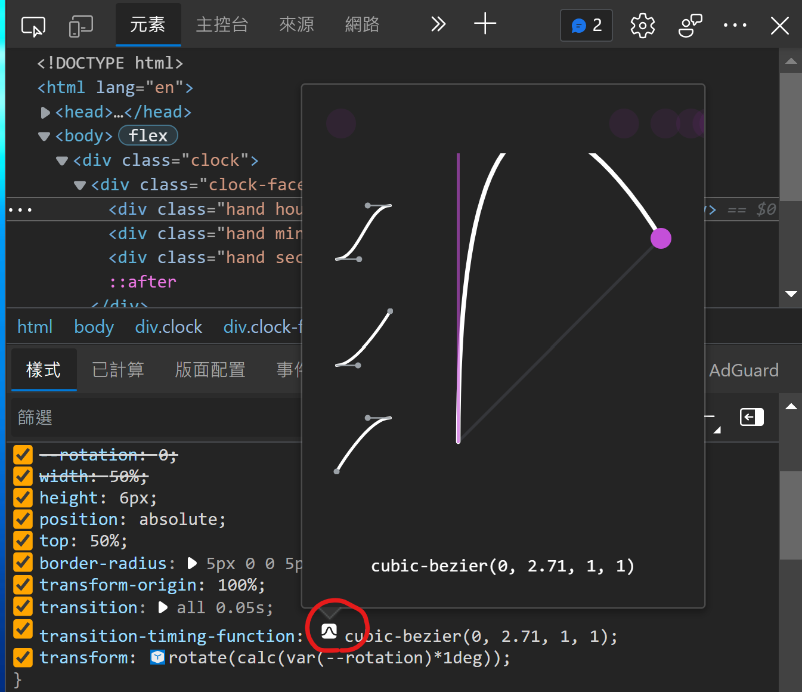

## 02 - JS and CSS Clock
### 製作流程
1. 觀察
2. 構想程式邏輯

### 觀察
1. 三個 hand 的 css transform 每秒鐘會改變
2. 使用的是現在的日期
3. 指針會有點往回抖動的效果


要做的事 :  
1. 取得現在的日期，抓出個別的秒分時在換算成角度
2. 在 css transition 加入動畫曲線


### 學習筆記  
#### Web APIs (setInterval)   
`setInterval(fn,delay)` : 每 x 秒執行一次。前者放執行的函式，後者每秒間距。  
回傳的是一個數字，是計時器的 ID。  
fn 是不會帶有參數的 function，也不能回傳東西，第三個參數寫入，可以讓 function 使用參數。  

```javascript
setInterval(setClock,1000)
```  

參考 : [setInterval](https://developer.mozilla.org/zh-TW/docs/Web/API/setInterval)  
#### CSS : transition-timing-funcion  
css transition 動畫特效  
`transition-timing-funcion` : 可以搭配 ease、ease-in-out 等等多種特效，讓動畫比較不會太死板。  

- 可以使用貝茲取線 (cubic-bezier)  
  在 devtool 上先用用看在貼到程式碼   
      

參考 : [transition-timing-function](https://developer.mozilla.org/zh-TW/docs/Web/CSS/transition-timing-function)

### 再進一步  
1. 把指針的長短分別出來    
   個別加入 hand 的 CSS  
   ```css
    .second-hand {
      height: 2px;
    }

    .min-hand {
      height: 4px;
      width: 40%;
      left: 10%;
    }

    .hour-hand {
      width: 30%;
      left: 20%;
    }
   ```
2. 把 function 重複的動作寫成 function    
   設定角度重複了所以改成 function 
   ```javascript
    function setRotation(hand, rotate) {
        const deg = rotate * 360;
        hand.style.transform = `rotate(${deg + 90}deg)`;
    }
    //使用 
    setRotation(secondhand, secRatio);
    setRotation(minhand, minRatio);
    setRotation(hourhand, hourRatio);
   ```
3. 懶的每次 + 90 ，因為原始檔案指針起點是 270，在 clock-face 加上 90 度，讓指針從 0 度開始 
   ```css
    .clock-face {
        //...
      transform: rotate(90deg);
    }
   ```
4. css 的 variable ，css 可以自訂義變數，並且在 javascript 使用
   ```css
    .hand {
      --rotation: 0;
      //... 略
      transform: rotate(calc(var(--rotation)*1deg));
    }
   ```
   - `setProperty('variable',value)`
   ```javascript
   function setRotation(hand, rotate) {
    const deg = rotate * 360;
    hand.style.setProperty("--rotation", deg);
    }
   ```
   


### 遇到的問題
當秒針轉一圈的時候，會出現回溯  
轉一圈到 0 度的時候，`deg = 90`，transition 因為每次呼叫都會重新來一次，那一秒就會從 90 度飛到正確位置，造成一秒會跳畫面。    

解決 : 拔掉 `transition` 就不會突然跳一下。

### 總結 
這次有了解到 setInterval 的用法以及 transition 動畫特效。    

