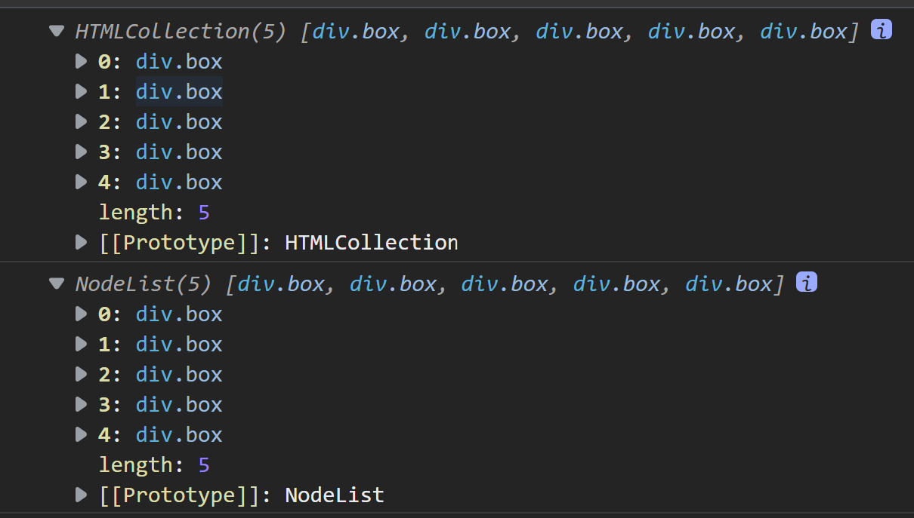

## 03 - CSS Variables
### 製作流程
1. 觀察
2. 構想程式邏輯

### 觀察
1. input 改變的時候，html 標籤會有數值
2. h2 的 JS 也會變顏色
3. 一開始進去圖片就有樣式
4. 每個 input 都有 name ，blur 跟 spacing 有 data-sizing

要做的事 :  
1. 使用 onchange event
2. 修改與建立自訂的 css variable

### 學習筆記  
#### 自訂義 CSS 變數
```css
:root{
    --spacing: 10px;
    --blur:10px;
    --base:#ffc600;
}
.hl {
    color: var(--base);
}
img {
    filter: blur(var(--blur));
    padding: var(--spacing);
    background-color: var(--base);
}
```  
- `:root` : 全域變數放置的位置，會出現在 html 標籤上
- `var(--variable)` : 使用變數  

#### javascript 使用 css 變數
- `setProperty('變數名',value)`   

因為是在 `:root`，節點是指 html  
所以 javascript 要取得根元素 `html` 是 `document.documentElement`  

```javascript
document.documentElement.style.setProperty(`--${this.name}`,this.value + unit);
```
參考 : [document.documentElement](https://developer.mozilla.org/zh-TW/docs/Web/API/Document/documentElement)
#### Nodelist v.s Array
這兩個是不一樣的，底層的 prototype 是不一樣的  
Array 的一些內建函式，像 map、filter 等等不能用在 NodeList 上  
Nodelist 是類陣列，只能用 `forEach` 或是 `for-loop`、`for...of` 迴圈，但是不能用 `for...in`  

Nodelist 是瀏覽器的 API  
Array 是 JS API  

> getElementsByClassName v.s querySelectorAll  
> 兩者取到的都是類陣列。前者是 `HTMLCollection`，後者是 `NodeList`。如果要使用 Array 的內建函式，必須先轉成 Array  
>


參考 : [NodeList 與 Array 差異](https://ithelp.ithome.com.tw/articles/10211876)  

#### dataset  
- `dataset` : 會抓到所有 `data-*`  

> `getAttribute('data-sizing')` v.s `dataset.sizing` ?  
> 兩者都可以達到同效果，前者的屬性都可以自訂，後者專處理 `data-*`  

#### onchange & oninput
- `onchange` : 當 input 的 value 改變，而且元件失去焦點才會呼叫 function 
- `oninput` : 只要 value 改變立即就呼叫，IE9 以下不支援

教學是使用 `mousemove`

### 總結   
1. CSS 自訂義 : `--變數名`，使用變數 :  `var(--變數)`
2. input 的事件處理 `onchange`、`oninput` 
3. 以及 `data-*` 的使用方法
