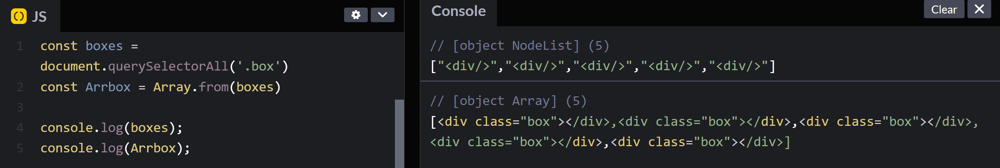

## 04 - Array Cardio Day 1
### 製作流程
1. 構想程式邏輯  

這次都在 `console.log` 呈現  
### 學習筆記  
#### console.table
以往只會 `log`，沒想到可以變成表格  

其他 : 
- `.error()` : 印出錯誤訊息
- `.table()` : 印成表格


#### map()
會產生一組新的陣列，對每個元素做點事，回傳的是一組變化過的新陣列   
原本作用的陣列不會受影響  
```javascript
const arr = [1,2,3]
const arr2 = arr.map(el=>el*2)
console.log(arr) // [1,2,3]
console.log(arr2) // [2,4,6]
```

>不適合使用 `map` 的情況    
>1. 要對原本的陣列操作，不打算回傳新陣列
>2. 沒有要回傳值  

`map(fn,[optional thisArgs])`  
第一個參數為作用的 function ，function 中包含三參數 `function (element,index,array)`  
1. currentValue : 當前的元素
2. index : 元素的索引
3. array : 本身的陣列

#### filter()
簡單來說就是過濾，true 就是留下的，false 是捨去的  
會回傳一組已經篩選過的 **新陣列**  

```javascript
const arr = [1,2,3]
const arr2 = arr.filter(el=>el>=2)
console.log(arr) // [1,2,3]
console.log(arr2) // [2,3]
```  
`filter(fn,[optional thisArgs])`  
第一個參數為作用的 function ，function 中包含三參數 `function (element,index,array)`  
1. currentValue : 當前的元素
2. index : 元素的索引
3. array : 本身的陣列

#### sort() : 排序  
`sort(compareFunction)` : compareFunction 會傳入兩個參數，通常會寫作 `a、b`，做為比較值，比較 Unicode 大小。會回傳排序過後的陣列。   
 
如果沒有特別寫規則，排序會優先轉為字串，再去比較  
最典型的例子就是    
```javascript
const res= [1,2,11,33,220].sort()
console.log(res) //[1,11,2,220,33]
```  
對於字串來說，`11` 的 1 比 2 優先排序  
compareFunction 就要寫入自己的規則，通常有三種情況  
1. `a > b` : b 會排在 a 前面 (\[b,a\])
2. `a < b` : a 排在 b 前面 (\[a,b\])
3. `a = b` : 如果是穩定排序，會按照原本陣列的安排前後。不穩定的話，前後排序不一定，目前 ES10 後的都是穩定的， IE 不支援穩定性排序 QQ。    
實際上 ECMAscript 標準沒規範，兩個相等的時候誰排前還後。  

```javascript
function compare(a, b) {
  if (a < b ) {  // a 排在 b 前面
    return -1;
  }
  if (a > b ) { // b 排在 a 前面
    return 1;
  }
  return 0; // 相等
}
```

如果是 **數字** 排列，可以使用 `a-b`，這樣 a 會排在 b 前面  
**字串** 的話會排序 ASCII code 大小   


上面修改
```javascript
const res= [1,2,11,33,220].sort((a,b)=>a-b)
console.log(res) //[1,2,11,33,220]
```  

> 排序有很多種方法，我也很好奇 sort 是採用什麼樣的方式去排，因此查了一下， 官方是寫`原地算法`(???)     
> Chrome 在 elements 小於 10 時會用插入排序 ，大於 10 時會用快速排序  
> 參考 : [前端工程師用 javaScript 學演算法系列 第 19 篇](https://ithelp.ithome.com.tw/articles/10217933)  

#### reduce()  
前一個索引跟下一個索引進行計算值，第一個索引值是跟指定的初始值做計算  
```javascript
[4,2,3,1].reduce((previousValue,currentValue)=>previousValue +currentValue ,0) 
// 陣列元素相加
// 結果會是 10
```
`.reduce(function(accumulator,currentValue,index,arr){ ... },initValue)`  
function 還有四個參數  
1. accumulator : 上次計算完的返回值
2. currentValue : 目前處理的元素
3. index : 如果有 initValue ，會從 0 開始，沒有的話從 1
4. arr : 指對陣列本身做修改  

- initValue 初始值

#### Sting.prototype.includes()
判斷字串裡是否有符合的字，有的話回傳 `true`，反之 `false`  
```javascript
const result = 'hello world'.includes('a')
console.log(result) // false
```

#### from()
對類陣列或可迭代(???)的陣列複製一份新的陣列  
[03 篇](../03%20-%20CSS%20Variables/memo-03.md)有提到 Nodelist 不是真的陣列，不能使用陣列的內建函式，因此需要先變成真．陣列。  

```javascript
const boxes = document.querySelectorAll('.box')
console.log(boxes)

const Arrbox = Array.from(boxes)
console.log(Arrbox)
```
  

`from(arraylike,mapfn,thisArgs)` 包含三個參數
1. arraylike : 要轉變的類陣列
2. mapfn : 等同於 `.map()`
3. thisArgs : mapfn 回傳陣列指向的 this   

所以 `Array.from([1,2,3],x=> x*2)` = `Array.from([1,2,3]).map(x=>x*2)`  

#### 解構語法  
ES6 的解構語法，除了把後面打開，前面也可以  
```javascript
const arr = [1,2,3]
const arr2 = [...arr,4,5,6]
console.log(arr2)

const obj ={
    name : 'rosa',
    age: 18,
    phone:'123555763',
    a:3,
}
const {name,age,...rest} = obj // ...rest 指的是剩下的
console.log(rest) 
```

### 總結   
這次練習更熟悉 Array 的內建函式。  
在 CodeWar 寫 kata 時常常會碰到這些的排列組合，更要了解回傳值是什麼，才不會濫用。  

